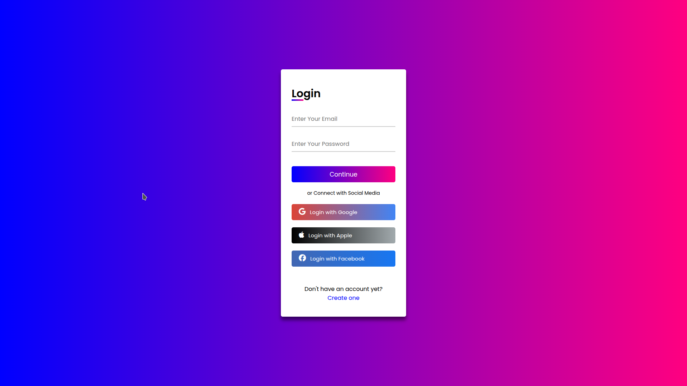

# ColorLogin

A modern, animated login and signup form built with HTML and CSS. This project provides a visually appealing authentication UI, including options for social login, designed for easy integration into web projects.

## Features
- **Animated login and signup forms** with smooth transitions
- **Responsive design** for desktop and mobile
- **Social login buttons** (Google, Apple, Facebook)
- **Modern UI** using custom CSS and Google Fonts

## Demo


## Getting Started

1. **Clone the repository**
   ```bash
   git clone https://github.com/ZahaAnass/ColorLogin.git
   ```
2. **Navigate to the project directory**
   ```bash
   cd ColorLogin
   ```
3. **Open `login.html` or `signup.html` in your browser**

## File Structure
- `login.html` — Login form page
- `signup.html` — Signup form page
- `style.css` — Styles for both forms

## Usage
- Open `login.html` to access the login form
- Open `signup.html` to access the signup form
- Edit the HTML or CSS files to customize the forms for your project

## Customization
- **Colors:** Change the `--main-color` and `--second-color` CSS variables in `style.css` for your brand
- **Fonts:** Easily swap Google Fonts in the CSS import
- **Social Buttons:** Update social login links as needed

## Credits
- [Font Awesome](https://fontawesome.com/) for social icons
- [Google Fonts](https://fonts.google.com/)

## License
This project is open source and available under the [MIT License](LICENSE).
